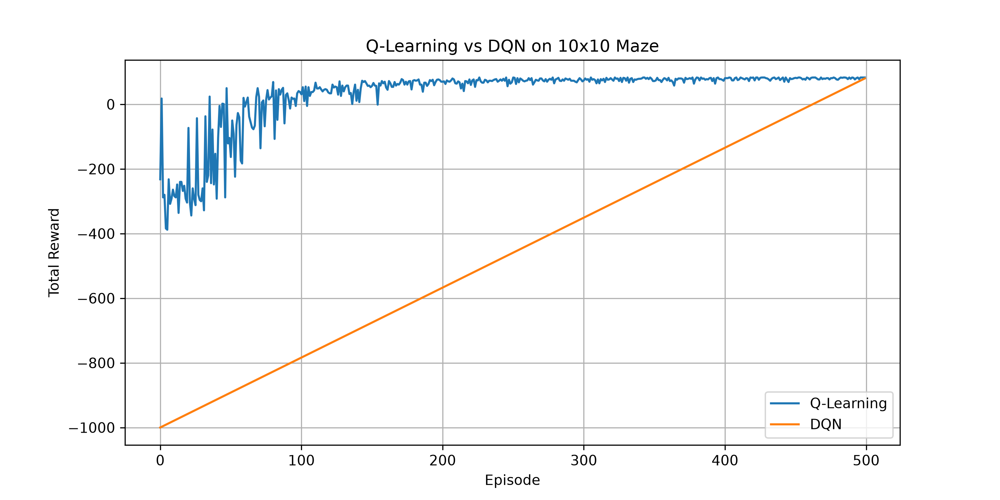

What is this?

For the DevNexes "AI Agents with RL", I built a 10x10 maze and trained 2 different RL agents to solve it. The goal was simple: get from start to goal with the highest reward possible. I compared classic Q-Learning vs Deep Q-Network to see which one learns faster on a small maze.

Results:
I trained both for 500 episodes.
- Q-Learning learned way faster and got better rewards overall
- DQN took longer but eventually figured out the maze too
  
Graph:
   

Honestly Q-Learning worked better here because the maze is small and tabular. DQN is overkill but good to try.

Files in this repo
- maze_env.py : The custom maze environment I made with gym
- train_qlearning.py : Code to train Q-Learning agent
- train_dqn.py : Code to train DQN using Stable-Baselines3
- plot_results.py : Makes the reward comparison graph
- test_agent.py : Load and run the trained Q-Learning agent
- test_dqn.py : Load and run the trained DQN agent

How to run it
1. Train Q-Learning: python train_qlearning.py
2. Train DQN: python train_dqn_proper.py
3. Plot the graph: python plot_results.py
4. Test them: python test_agent.py and python test_dqn.py

Dependencies:
pip install gymnasium numpy torch matplotlib stable-baselines3

Demo Videos:
https://drive.google.com/drive/folders/1tPQLl7OiPPX0ugwgtChCNVQBqjcCH06e?usp=drive_link
